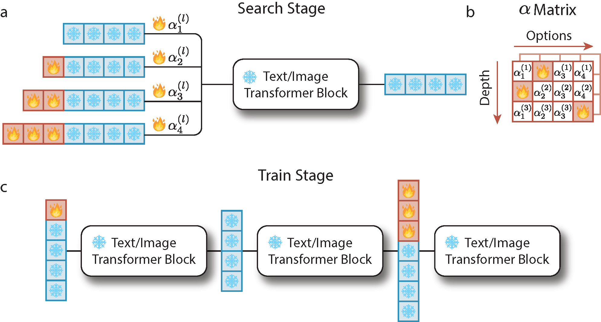

# Differentiable Prompt Learning for Vision Language Models

This repository is the official Pytorch implementation of [Differentiable Deep Prompt Learning for Vision Language Models]().

## Introduction

TLDR: We propose a method dubbed differentiable prompt learning (DPL). We test the DPL method on the pre-trained vision-language model. We empirically find that only using limited data, the DPL method can find deep continuous prompt settings with high confidence. The performance on the downstream tasks exhibits the superiority of the automatic design.

<div align="center">
  
  <p align="center"><b>Overview of our method.</b> We use the search stage to determine how to insert deep continuous prompts and use the searched prompt setting to boost the performance of the vision-language model.</p>
</div>

## Code Setup

### Installation

- Create visual environment
```bash
conda create -n dpl
conda activate dpl
```

- Install required packages
```bash
pip install -r requirements.txt
```

- Dataset Preparation

Please follow the instruction at [DATASETS.md](docs/DATASETS.md) to prepare all datasets.

## Usage

- Search stage
```bash
bash scripts/trainersupernet/launch_nas.sh Caltech101 <output_dir> 1 16
```

- Train stage
```bash
bash scripts/trainersubnet/launch_train.sh Caltech101 <output_dir> <alpha_image_path> <alpha_txt_path> 1 16
```

## License

DPL is released under the Apache License. Please see the [LICENSE](LICENSE) file for more information.

## Citation

If you find this repo is helpful, please kindly consider citing our work:

```
@article{huang2025dpl
    title={Differentiable Prompt Learning for Vision Language Models},
    author={Huang, Zhenhan and Pedapati, Tejaswini and Chen, Pin-Yu and Gao, Jianxi},
    journal={34th International Joint Conference on Artificial Intelligence},
    year={2025}
}
```

## Acknowledgement

Our work is built upon [CoOp](https://github.com/KaiyangZhou/CoOp). We extend our gratitude to authors.
